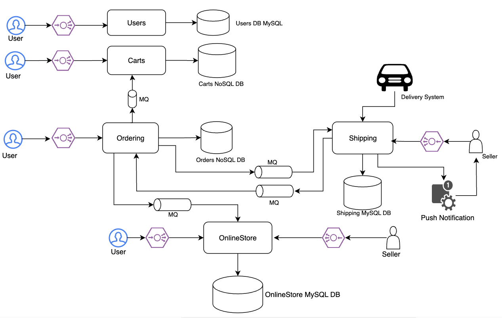
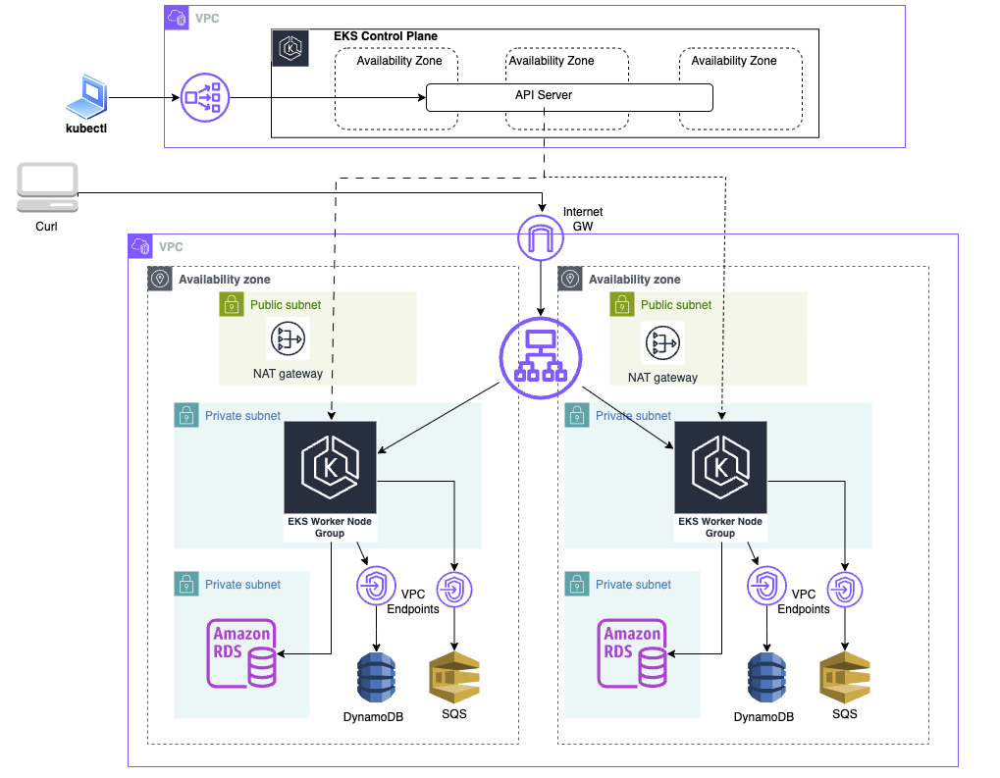

# Ecommerce Service
Ecommerce Service `demo-eshop` consists of following microservices:
- Users
- Carts
- Ordering
- Shipping
- Online Store

## Design


## AWS Infrastructure



## Create Infra in AWS using terraform
```
$ cd ecommerce/terraform/ecommerce_infra/
$ terraform init
$ terraform plan
$ terraform apply
```

## Docker build commands
- `docker compose build <service_name>`
- `docker tag <image_id> hpsawant2013/<service_name>:1.1.0`
- `docker push hpsawant2013/<service_name>:1.1.0`

## To build and push docker images use github actions workflow
`workflows/build_and_push_docker_image.yaml`

## AWS STS
Before running aws or kubectl or helm commands, export aws credentials to yur shell environment. The `aws_sts.sh` script will generate export commands that you can run.
```
$./ecommerce/bin/aws_sts.sh
Run following to export AWS sts creds to your shell env
export AWS_ACCESS_KEY_ID=XXXXXX
export AWS_SECRET_ACCESS_KEY=XXXXX
export AWS_SESSION_TOKEN=XXXXX
```

## Generate KubeConfig
Create or update a kubeconfig file for your cluster. Replace region-code with the AWS Region that your cluster is in and replace my-cluster with the name of your cluster.
`aws eks update-kubeconfig --region <region> --name <cluster_name>`

