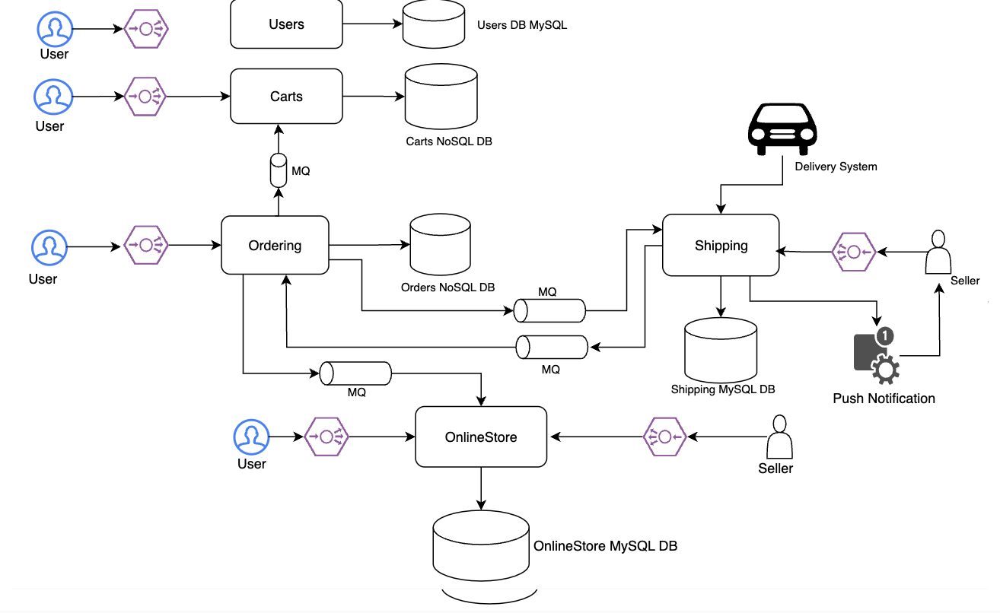

# Ecommerce Service
Ecommerce Service `demo-eshop` consists of following microservices:
- Users
- Carts
- Ordering
- Shipping
- Online Store

## Design

## AWS Infrastructure

## Docker build commands
- `docker compose build users_service`
- `docker tag <image_id> hpsawant2013/users_service:1.1.0`
- `docker push hpsawant2013/users_service:1.1.0`